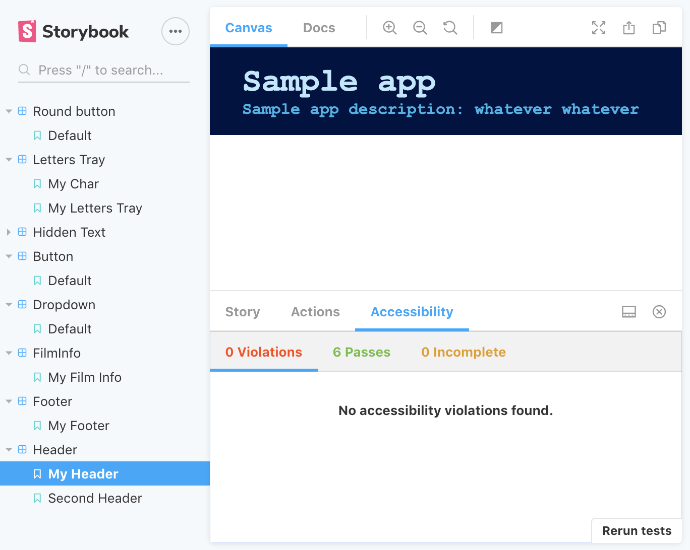

  

## My Storybook 

<strong><a href="https://zurda.github.io/my-storybook/">Here's the project link</a></strong>

## About this project 

This is the second project in my #52Projects in 2020 ([project #1](https://github.com/zurda/hangman-react)). 

I was set to build a component library to make reusable components for my future projects. One of my goals for this project was to attempt to add this library to my previous project rather than have the components styled in the repo - I'm afraid I haven't come around to that, but it's the next step. 

Used storybook, `create-react-app`, `emotion`, `typescript`, `prettier`, `gh-pages`, Github Actions, and `tslint`. 

## Running locally

To run the project locally: 

1. Clone this repo
2. `cd` into the project, and run `yarn && yarn storybook`
3. That's it! You should see the project in `http://localhost:9009/`

## Things I did, Lessons learned

- **Snapshots testing**: implemented these since it appeared to be a quick win. These tests are fast to set up, but the benefit isn't huge. For me, it serves as an alert if something out of the ordinary happens (eg a component I didn't plan to change somehow change). Another quick win is that these tests are a good reminder to keep your components as small as possible. If they aren't - maintaining the snapshot tests will quickly get out of hand and have 0 benefit. 
- **Addons**: I really liked the accessibility addon. Accessibility is something that's easy to forget about when it's actually great to implement from the get go. Another addon I tried was Source code - didn't get much benefit from it, as it only displays the story and the docs addon seems to do that and more. 
- Different ways to set up the **file tree**: self explanatory. This will take some more projects until I have a solid opinion on. At the moment I think I can adjust to just about any file structure, because they're all messy. 
- **preview-head.html**: This could be a blessing and a curse. Whatever is in that file gets applied in storybook but I can imagine that if something is added into storybook - it might give the wrong impression about how the components look, when actually - the components are affected by whatever is in these head tags. 
- Gained more practice in **setting up a project quickly**. One of my goals this year was to have something I'll feel reasonabely comfortable sharing after **one week** of work. This turned out to be too short for the list of requirements, but my hope is that this will be an ongoing project rather than a week only thing (time will tell).

### Planning Process

I started this on January 8, 2020. Here's a list of things I wrote down when planning this project. Maybe it's because it was a busy week, or because it was odd to create components I don't yet need (how do I style it to fit a non existing project?), but a lot of these remained in the todo side of things:

- Create component library for future projects 
- Use typescript 
- Prefer children over props
- Visual tests 
- CI 
- Modal component // still todo
- Nav component // still todo
- Button component 
- Anchor component 
- Header component 
- Footer component 
- Collapsible component 
- Radio button component 
- Input field component 

### Still to do

- Types fixes
- Add visual tests
- Check out **yarn link**
- Add components 
- Make it easier to share colour themes (common fields?)

There are probably other issues, but these are the next priorities

## Contributions

This project is absolutely accepting pull requests (first-timers welcome!). Feel free to report bugs and suggest features by opening a new issue. Check out the open 

This is it for now. See you on project #3 (I hope)

